<!--
  Neon-cyberpunk animated profile README for @Akarshit-Bansal
  Local SVGs (assets/*.svg) are regenerated daily by .github/workflows/update-profile-art.yml
  The contribution snake is built by .github/workflows/snake.yml (Platane/snk)
  Live cards (stats / streak / typing) are hosted services, themed to match.
  Reminder: GitHub strips inline style= and JS — all animation lives INSIDE the SVGs.
-->

<h3 align="center">
  
</h3>

  <code>~/akarshit $ ./whoami --animated</code>

<!-- ── portrait + neofetch card ── -->
<table align="center" border="0" cellpadding="0" cellspacing="0">
  <tr>
    <td valign="top" align="center"></td>
    <td valign="top" align="center"></td>
  </tr>
</table>

<!-- ── tech stack ── -->
<h3 align="center">// TECH STACK</h3>

  
  
  
  
  
  
  
  
  
  
  
  

<!-- ── impact ── -->

<!-- ── contributions ── -->

<code>~/akarshit $ git log --graph --contributions</code>

<!-- ── contribution snake (Platane/snk output branch) ── -->

  

<!-- ── live stats + streak (hosted, neon-themed) ── -->

  
  

  

<!-- ── connect ── -->

  
  
  
  
  

  

<!--
  Regenerate the local art:
    pip install -r requirements.txt
    export GITHUB_USER=Akarshit-Bansal
    for s in portrait info_card heatmap tech_stack waves stats snake; do python scripts/gen_$s.py; done
-->
